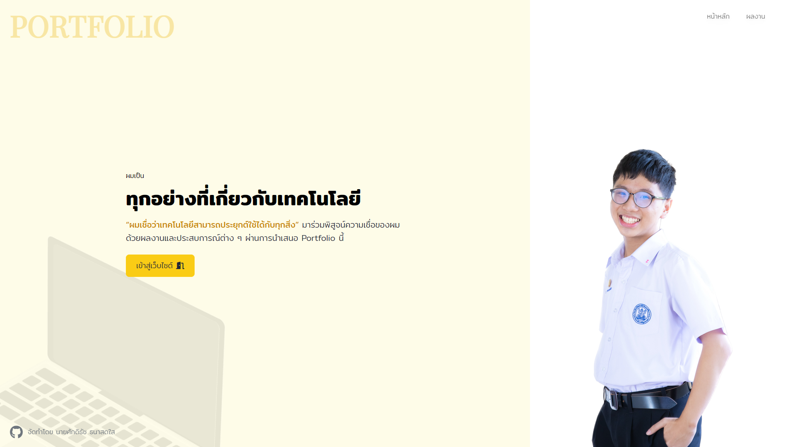

# Personal Portfolio Website

Welcome to Sakditach Thanasodsai's Personal Porfolio Website.



## View my portfolio

To visit my website, simply go to [my deployed website on Vercel](https://lemasc-m6-portfolio.vercel.app).

## Development

### Technologies used

This project is a JavaScript based website created using the following technologies.

- [Astro](https://astro.build/) for website framework. Includes built-in markdown content collection, which is the key to use in this project.
- [TailwindCSS](https://tailwindcss.com/) for website styling.
- [React](https://react.dev/) for some parts of this website interactivity.
- [MDX](https://mdxjs.com/) is an advanced Markdown parser with JSX support.

### Running the project locally

First, install Node.js and Yarn. We use the latest stable version of Yarn for development.

Clone the repository and run the following command to install any dependencies.

```
yarn
```

To start the development server, run the following command.

```
yarn dev
```

To build this website and prepare for deploying on Vercel, run the following command.

```
yarn build
```

To start the production server, run the following command.

```
yarn start
```

### Project Structure

Inside of the project, you'll see the following folders and files:

```
/
├── public/
├── src/
│   └── content/
│   └── pages/
└── package.json
```

The `content` folder contains markdown files used inside the website to be rendered using MDX. Usually articles are placed here.
The `pages` folder contains pages to be rendered as a route.

Static assets, mostly images and videos, are placed in the `public/` directory.

Other folders are created to organize code, usually components.

This project has been setup to support internationalization (i18n) by using the `astro-i18n` package.

## License

MIT
